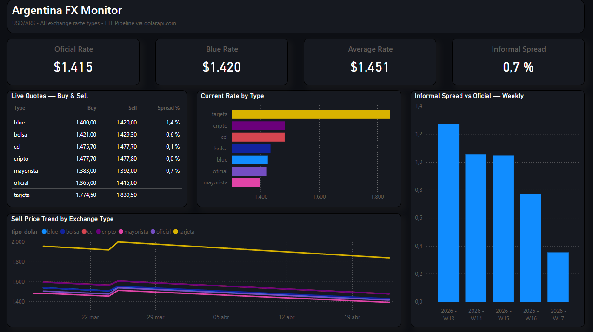
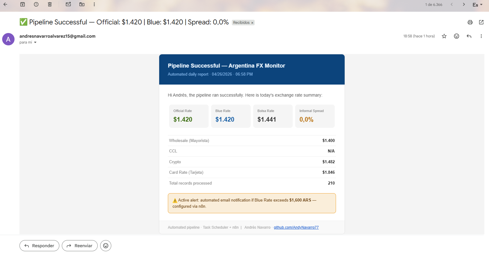
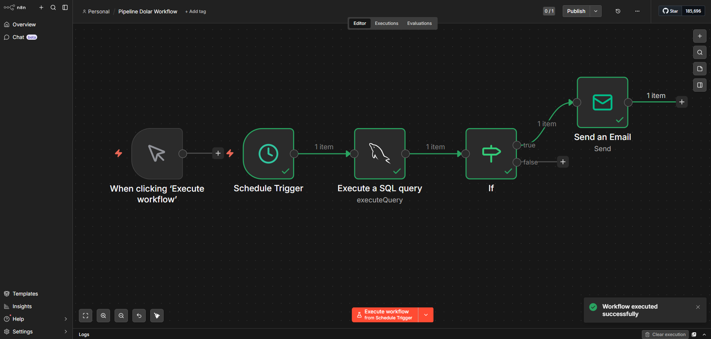

# 📊 Automated Dollar Exchange Rate Pipeline — Argentina FX Monitor

> **End-to-end ETL pipeline that turns Argentina's volatile FX data into real-time business intelligence — fully automated, zero manual intervention.**

[](https://python.org)
[](https://mysql.com)
[](https://powerbi.microsoft.com)
[]()
[]()

---

## 🧠 The Business Problem

Argentina operates with **7 concurrent dollar exchange rates** — each with distinct implications for pricing, contracts, imports, and financial planning. The gap between the official rate and the informal (blue) rate can shift several percentage points in a single week, directly impacting business costs, margins, and strategic decisions.

Monitoring these rates manually is:
- **Time-consuming** — requires checking multiple sources daily
- **Error-prone** — copy-paste errors and outdated snapshots
- **Reactive** — decisions happen *after* the opportunity or risk has already moved

**This pipeline eliminates that friction.**

---

## ✅ The Solution

A fully automated data pipeline that extracts live FX data, processes it, stores it with integrity controls, and surfaces it through an interactive dashboard — with proactive alerts when rates cross critical thresholds.

> *From raw API data to actionable dashboard in under 60 seconds. Runs daily without human intervention.*

---

## 📐 Architecture Overview

```
┌─────────────────┐    ┌──────────────────┐    ┌─────────────────┐
│   dolarapi.com  │───▶│  Python ETL      │───▶│   MySQL DB      │
│   (Public API)  │    │  extract_dolar.py│    │  (UPSERT logic) │
└─────────────────┘    └──────────────────┘    └────────┬────────┘
                                                         │
                              ┌──────────────────────────▼──────────┐
                              │         Power BI Dashboard           │
                              │  (Live KPIs · Trends · Spread)       │
                              └─────────────────────────────────────┘
                                         │
              ┌──────────────────────────┼──────────────────────────┐
              │                          │                           │
     ┌────────▼────────┐       ┌─────────▼──────────┐               │
     │ Task Scheduler  │       │       n8n           │               │
     │ (Daily trigger) │       │ (Threshold alerts)  │               │
     └─────────────────┘       └────────────────────┘               │
```

---

## 🔄 Pipeline — Step by Step

| Step | Action | Technology | Business Value |
|------|--------|------------|----------------|
| 1 | Extract live FX data from public API | Python · requests | Always current data, no manual lookup |
| 2 | Validate, clean and transform | Python · pandas | Ensures data quality and consistency |
| 3 | Historical data simulation for trend analysis | Python · pandas | Enables time-series insights from day one |
| 4 | Load to relational database with UPSERT | MySQL · SQL | Prevents duplicates, maintains data integrity |
| 5 | Interactive visualization and KPIs | Power BI | Decision-ready insights at a glance |
| 6 | Daily automated execution | Windows Task Scheduler | Zero operational overhead |
| 7 | Threshold-based email alerts | n8n | Proactive notification before manual discovery |

---

## 📊 Dashboard

The Power BI dashboard was designed to answer the questions that matter to decision-makers:



**What it surfaces:**

- **Live Buy & Sell quotes** across all 7 rate types (blue, bolsa, CCL, cripto, mayorista, oficial, tarjeta)
- **Current Rate by Type** — horizontal bar chart for instant visual comparison
- **Sell Price Trend** — time-series view tracking rate evolution since March 2026
- **Informal Spread vs. Official (weekly)** — week-over-week gap analysis to detect volatility patterns
- **KPI Cards:** Oficial Rate · Blue Rate · Average Rate · Informal Spread %

---

## 🔔 Automation & Alerts

**Scheduled execution** via Windows Task Scheduler ensures the database and dashboard refresh daily without any manual step.

**Proactive alerts** via n8n workflow: when the Blue rate crosses a defined threshold (e.g., > $1,600 ARS), an automated email notification is triggered — enabling teams to act on market movements in real time rather than discovering them in the next report.

---

## ✉️ Live Proof — It Actually Runs

This pipeline isn't just code — it runs in production every day. Below is proof:

**Automated HTML email report delivered daily:**



**n8n workflow — event-driven alert logic:**



> The email report is automatically generated and sent after each successful pipeline run, including live KPIs: Official Rate, Blue Rate, all exchange types, Informal Spread %, and total records processed.

---

## 💡 Key Results & Value Delivered

| Before | After |
|--------|-------|
| Manual daily check across multiple sources | Automated daily ingestion from a single API |
| No historical record for trend analysis | Structured time-series database for any period |
| Reactive awareness of rate movements | Proactive email alerts on threshold breaches |
| Static snapshots with no comparison | Interactive dashboard with multi-rate comparison |
| High operational overhead | Zero manual intervention after deployment |

---

## 🛠️ Tech Stack

| Layer | Technology | Purpose |
|-------|------------|---------|
| Extraction | Python · requests | API consumption and raw data retrieval |
| Transformation | Python · pandas | Cleaning, typing, deduplication |
| Storage | MySQL 8.0 · SQL | Relational persistence with UPSERT logic |
| Visualization | Power BI | Interactive dashboard and KPI reporting |
| Scheduling | Windows Task Scheduler | Automated daily pipeline execution |
| Alerting | n8n | Event-driven email notifications |

---

## 📁 Repository Structure

```
pipeline-dolar-argentina/
│
├── extract_dolar.py       # Main ETL script — extraction, transformation and load
├── requirements.txt       # Python dependencies
├── .env.example           # Environment variables template (no credentials)
├── dashboard/             # Power BI .pbix file
├── data/                  # Historical data files
├── img/                   # Dashboard and report screenshots
└── README_ES.md           # Spanish version
```

---

## 👤 Author

**Andrés Navarro**
Data Analyst · BI · ETL · Python · SQL

[](https://github.com/AndyNavarro77)
[](https://www.linkedin.com/in/andr%C3%A9s-navarro77/)
[](https://andres-navarro-portfolio.netlify.app/)

---

*Built to demonstrate end-to-end data engineering, automation, and business-oriented analytics — skills applicable to any industry where data freshness and operational efficiency matter.*